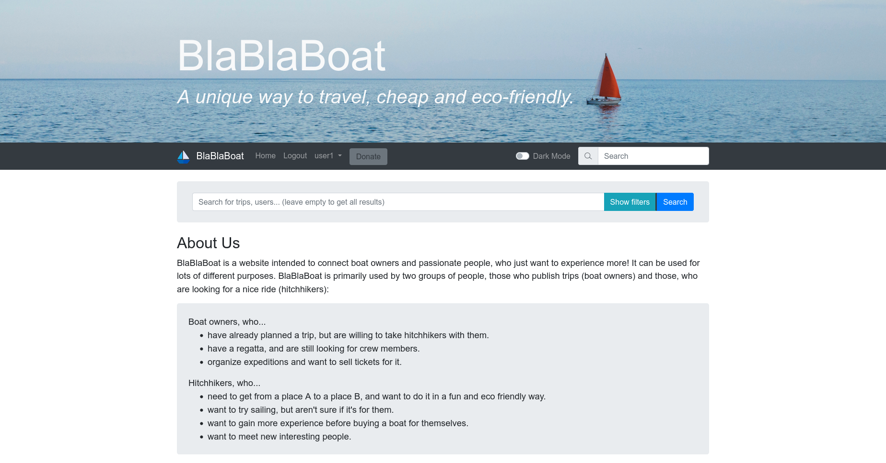

#  BlaBlaBoat



BlaBlaBoats is a website created with [Flask](https://flask.palletsprojects.com/en/2.2.x/) and [Elasticsearch](https://www.elastic.co/elasticsearch/)

## Table of contents
* [General info](#general-info)
* [Technologies](#technologies)
* [Setup](#setup)
* [License](#license)
* [Contact](#contact)


## General info

BlaBlaBoat is a website intended to connect boat owners and passionate people, who just want to experience more! It can be used for lots of different purposes. BlaBlaBoat is primarily used by two groups of people, those who publish trips (boat owners) and those, who are looking for a nice ride (hitchhikers).

[> Here is a live demo: ...]: #


## Technologies

* [Python 3.8](https://www.python.org/)
* [Flask](https://flask.palletsprojects.com/)
* [Elasticsearch](https://www.elastic.co/elasticsearch/)
* [Sendgrid](https://sendgrid.com/)
* [Stripe](https://stripe.com/)
* [LeafletJS](https://leafletjs.com/)
* [Google Maps Autocomplete](https://developers.google.com/maps/documentation/javascript/place-autocomplete)
* [Bootstrap 4](https://getbootstrap.com/docs/4.0/)
* [Dark Mode](https://github.com/tedirghazali/codetube/tree/master/bootstrap/dark-mode)

All the python packages are listed in the `requirements.txt` file.


## Setup

To run this project you need to have python-3.8 and pip3 installed. The following instructions only work for running the app on **Ubuntu**.

1«. Clone the github repo:
```
$ gh repo clone FeliNUx42/BlaBlaBoat
```

2«. Install all the required packages:
```
$ pip3 install -r requirements.txt
```

3«. Create a `.env` file:
```
# required environment variables
FLASK_APP=main.py
FLASK_DEBUG=0

SECRET_KEY=<secret key>

STRIPE_PUBLIC_KEY=<stripe public key>
STRIPE_SECRET_KEY=<stripe secret key>

MAPS_API_KEY=<maps api key>

SENDGRID_API_KEY=<sendgrid api key>
SENDGRID_EMAIL=<sendgrid email address>

# optional environment variables
SERVER_NAME=<server name>
SQLALCHEMY_DATABASE_URI=<database uri>
ELASTICSEARCH_URL=<elasticsearch url>
```
Required environment variables:
* `SECRET_KEY`: a random string (can be created with `os.urandom(16).hex()`)
* `STRIPE_PUBLIC_KEY` and `STRIPE_SECRET_KEY`: stripe keys from [Stripe Dashboard](https://dashboard.stripe.com/dashboard)
* `MAPS_API_KEY`: your [Google Maps api key](https://developers.google.com/maps/documentation/javascript/place-autocomplete)
* `SENDGRID_API_KEY`: your [Sendgrid api key](https://app.sendgrid.com/settings/api_keys)
* `SENDGRID_EMAIL`: your Sendgrid email address

Optional environment variables:
* `SERVER_NAME`: websites server name
* `SQLALCHEMY_DATABASE_URI`: database url
* `ELASTICSEARCH_URL`: erlasticsearch api url

4\. Install & set up elasticsearch:

Follow [this guide](https://www.elastic.co/guide/en/elasticsearch/reference/current/deb.html) to install elasticsearch on Ubuntu. Then you will need to disable password protection for your elasticsearch database. Do this by editing the settings file (`/etc/elasticsearch/elasticsearch.yml`) and disable all security features.

If you still want to password-protect your elasticsearch database, you will need to do changes to the code (in `app/__init__.py`, line 36)

https://github.com/FeliNUx42/BlaBlaBoat/blob/affda726078946c04dd03639fa3f31863ad3e4a2/app/__init__.py#L36


5\. Run the app:
```
$ flask run
```


## License
This repository has no license. Therefore the work is under exclusive copyright. Nobody except me ([@FeliNUx42](https://github.com/FeliNUx42)) can copy, distribute, or modify this work without being at risk of take-downs, shake-downs, or litigation.


## Contact
Created by [@FeliNUx42](mailto:felix.bommier@gmail.com) - feel free to contact me!
